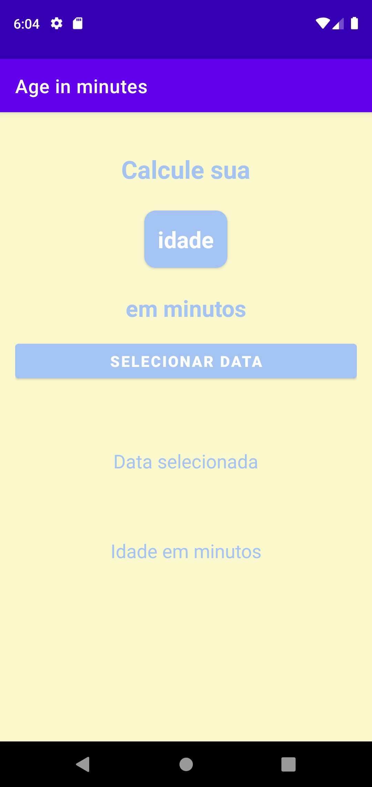

# AgeCalculator

Kotlin code that take a user's date of birth and converts it into minutes, using date picker.

# Requirements 

* Android Studio
* Android smartphone or an android emulator

# Output example 

